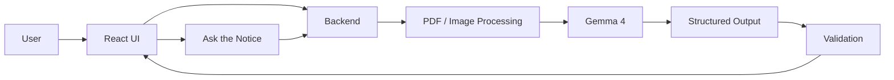

# NoticeLens

> **Understand the notice. Know what to do next.**

**Hackathon Track:** Best Use of Gemma 4 / Gemma 4 Open-Source

NoticeLens is a simple tool that helps users understand important notices, circulars and announcements shared as PDFs, photos or screenshots. It uses **Gemma 4** to read the document, pick out the important information and turn it into clear next steps.

---

## 1. Project Name
**NoticeLens**

## 2. Problem Statement
Important information is often shared as scanned notices, posters, screenshots or long PDFs. Finding the deadline, eligibility, required documents or next action can take time. Reading the text alone is not enough; the document has to be understood in context.

## 3. Project Overview
Users upload a notice. NoticeLens processes it and shows a short summary, important details, deadlines, required documents and action items.

**Flow:** Upload → Understand → Extract → Validate → Explain

## 4. Proposed Solution
We will build a lightweight web app that:
- accepts PDF, JPG and PNG files;
- uses Gemma 4 to understand the document;
- extracts important information into a fixed structure;
- validates the extracted data;
- shows the result in a simple checklist-style interface;
- answers questions about the uploaded notice.

## 5. Objectives
- Make notices faster and easier to understand.
- Use Gemma 4 for a real multimodal task, not just a chatbot.
- Reduce mistakes by validating model output.
- Keep the first version small enough to build during the final hackathon.

## 6. Target Users / Use Case
**Users:** Students, parents, colleges, community groups and anyone dealing with notices.

**Example:** A student uploads a college circular and immediately sees the deadline, required documents and what they need to do next.

## 7. Open-Source AI Technology Selected
**Gemma 4** will be the main AI component of the project.

## 8. Why This Technology Was Selected
Notices are not always clean text. They can contain images, tables, mixed formatting and information spread across a page. Gemma 4 is a good fit for understanding this kind of input and turning it into useful structured information.

## 9. AI's Role in the System
Gemma 4 will:
- understand the uploaded notice;
- identify its purpose;
- extract dates, names, fees, eligibility and required documents;
- create a short explanation;
- answer questions using the uploaded document.

The application itself will handle file processing and validation.

## 10. System Architecture



## 11. Component-Level Architecture
| Component | Role |
|---|---|
| React + TypeScript | User interface |
| Backend | Handles files and processing flow |
| PDF/Image Processor | Prepares the document |
| Gemma 4 | Main document understanding |
| Validator | Checks model output |
| Storage | Keeps the current document/session |

## 12. Data / Information Flow
1. User uploads a notice.
2. Backend checks and prepares the file.
3. Gemma 4 analyzes the document.
4. Important fields are returned in a fixed structure.
5. Validation checks dates, missing fields and formatting.
6. The UI shows the summary, actions and answers.

## 13. Agentic Workflow (if applicable)
A multi-agent system is **not required** for the first version. We will use a simple pipeline:

**Input Check → Document Understanding → Extraction → Validation → Explanation → Q&A**

This keeps the project practical for the final hackathon.

## 14. Technology Stack
- **Frontend:** React, TypeScript
- **Backend:** Python, FastAPI
- **AI:** Gemma 4
- **Document Processing:** PyMuPDF + image processing
- **Validation:** Pydantic / Python
- **Storage:** SQLite or lightweight session storage
- **Code:** Git + GitHub

## 15. Expected Features
### Core
- PDF/JPG/PNG upload
- Notice summary
- Deadline extraction
- Required documents
- Eligibility and fee details when present
- Action checklist
- Questions about the notice
- “Not found” response when information is missing

### Stretch
- Indian language explanations
- Highlight the source page/section for extracted information

## 16. Implementation Approach
We will build the project in small stages:

**Step 1:** File upload and validation  
**Step 2:** Gemma 4 document understanding  
**Step 3:** Structured extraction  
**Step 4:** Validation  
**Step 5:** Simple results dashboard  
**Step 6:** Document-based Q&A  
**Step 7:** Testing on different notice formats

## 17. Expected Final Output
For each notice, the system should produce something like:

```json
{
  "title": "Student Workshop",
  "summary": "Workshop for students interested in open source.",
  "deadline": "14 October 2026",
  "required_documents": ["Student ID"],
  "action_items": ["Register before the deadline"]
}
```

The user will see this as a simple interface rather than raw JSON.

## 18. Future Scope / Scalability
The same system can later support scholarship notices, exam circulars, event announcements, forms and other semi-structured documents. More languages and better source highlighting can also be added.

## 19. Open-Source Dependencies / Components
Planned open-source components include:
- Gemma 4
- React
- TypeScript
- FastAPI
- PyMuPDF
- Pydantic
- SQLite

The final project will be published under an appropriate open-source license.

## 20. Expected Challenges and Mitigation
| Challenge | Mitigation |
|---|---|
| Blurry or low-quality images | Basic image preprocessing |
| Wrong dates/numbers | Validation after extraction |
| Missing information | Show “not found” instead of guessing |
| Long PDFs | Process pages in a controlled way |
| Limited hardware | Keep the model setup lightweight |
| Short hackathon time | Build core features first, stretch features later |

---

## Qualifier Scope
This README is the **technical proposal for the qualifier round**. As required by the hackathon, the qualifier repository should contain **only `README.md`**. Implementation, datasets and other project files are for the final round.

## Team
**Team Name: Nebula Syndicate** To be added  
**Members: Bhoomika Girish , Sayali Pohankar , Jatin Shete ** To be added  
**Institution: Symbiosis Institute Of Technology, Nagpur** To be added

## References
- Hacktober Fest — Open Source AI Hackathon Technical Document
- Hacktober Fest — Four Final Problem Statements
